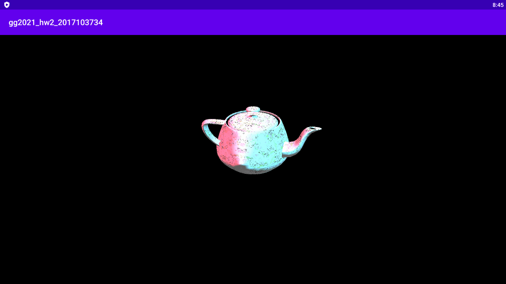

# gg2021_hw2    
2021 게임그래픽프로그래밍 과제2

## 작성코드
* [MainActivity.kt](/app/src/main/java/com/example/gg2021_hw2_2017103734/MainActivity.kt)    
* [vertex.glsl](/app/src/main/res/raw/vertex.glsl)   
* [fragment.glsl](/app/src/main/res/raw/fragment.glsl)    

## Result
 
